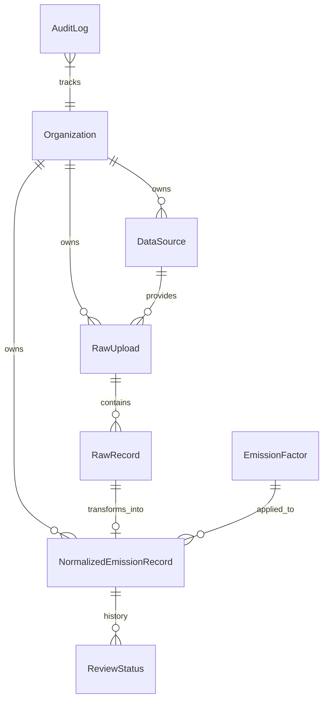

# Data Model Architecture

The `breatheESG` platform is designed to handle messy, heterogeneous data from multiple enterprise sources, normalize it into a unified schema, and provide full auditability for analysts.

## Entity Relationship Overview

## Core Design Principles

### 1. Multi-Tenancy Handling
Every significant model in the platform (from `RawUpload` to `NormalizedEmissionRecord`) contains a foreign key to the `Organization` model. 
- **Why?** This ensures strict data segregation at the database level. In a production B2B SaaS environment, a custom Django middleware or Row-Level Security (RLS) in PostgreSQL would automatically filter querysets by the requesting user's `Organization`. For this scope, the foreign keys establish the necessary foundation.

### 2. Source Traceability & Immutability
- **RawRecord**: When a CSV or JSON is ingested, every row is parsed into a Python dictionary and stored in `RawRecord.raw_data` as `JSONB`. **This data is immutable.** We never alter the `RawRecord`, even if the source data is malformed.
- **Why?** In enterprise ESG auditing, analysts must be able to prove *exactly* what the client uploaded. If we mutate the raw data during ingestion, we lose the audit trail.

### 3. Normalization Architecture
- `NormalizedEmissionRecord` holds the canonical, validated data ready for calculation.
- The platform uses a **Strategy Pattern** (`SAPIngestionService`, `UtilityIngestionService`, `TravelIngestionService`) to map the `RawRecord` dictionary into standard fields (`activity_value`, `category`, `period_start`).
- The `NormalizedEmissionRecord` maintains a `OneToOneField` back to the `RawRecord`. This allows the React frontend to display the exact original CSV row side-by-side with the final calculated CO2e, giving analysts complete confidence in the math.

### 4. Emission Factor Snapshot Pattern
When CO2e is calculated, the `NormalizedEmissionRecord` stores a foreign key to the `EmissionFactor` used, **but it also hardcopies the `emission_factor_value`** into its own row.
- **Why?** Emission factors update annually (e.g., DEFRA releases new grid factors). If we only stored the foreign key, an update to the underlying factor would retroactively change historical CO2e calculations, violating financial/ESG audit rules. Historical records must freeze the math exactly as it was when calculated.

### 5. Audit Trail Design
The `AuditLog` model is automatically populated using Django signals (`pre_save` and `post_save` on `NormalizedEmissionRecord`).
- It uses Django's `model_to_dict` to capture the `old_value` and `new_value` as JSON.
- **Why?** Analysts need to know who approved a record, when it was flagged, and if the CO2e value was manually overridden. Writing this logic directly into views is brittle. By using Django signals, we guarantee that *any* mutation to the database (even from the admin panel or a management command) generates an immutable log.

### 6. Scope 1/2/3 Categorization
Scope categorization is tied directly to the `EmissionFactor`, not the raw data.
- **Why?** A company's raw SAP data just says "Diesel". It is the `EmissionFactor` database that dictates that stationary diesel combustion is "Scope 1". By decoupling this, we can update categorization rules centrally without migrating millions of raw records.
