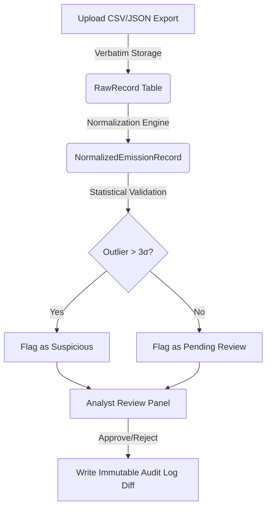

# breatheESG Testing Guide & Commands

This guide provides instructions and commands for testing the breatheESG ESG Emissions Ingestion Platform. It covers both **automated unit tests** and **manual end-to-end user acceptance testing (UAT)**.

---

## 1. Automated Testing (Pytest)

The project includes an automated test suite verifying core components: parsing logic, the normalization engine, unit conversions, and statistical anomaly detection.

### Prerequisites & Setup
1. **Initialize the Virtual Environment**:
   ```bash
   # Create python virtual environment
   python -m venv venv
   
   # Activate virtual environment
   # On Windows (PowerShell):
   .\venv\Scripts\Activate.ps1
   # On Windows (CMD):
   .\venv\Scripts\activate.bat
   # On macOS/Linux:
   source venv/bin/activate
   ```

2. **Install Dependencies**:
   ```bash
   pip install -r requirements.txt
   ```

### Running the Tests
To run the full suite of backend unit tests, run:
```bash
pytest
```
Or run with verbose output and warnings disabled:
```bash
pytest -v -W ignore
```

> [!NOTE]
> **Database Isolation**: The test suite is configured (via `breatheESG/settings.py` and `tests/conftest.py`) to automatically override connection settings and run on a fast, temporary **in-memory SQLite database**. This allows you to run unit tests at any time without needing a local PostgreSQL instance running or configured.

---

## 2. Local Environment Setup for Manual Testing

To run the application locally for manual verification and end-to-end testing:

### Database & Seed Data Configuration
Ensure you have PostgreSQL running, then configure your `.env` credentials in the root directory (based on `.env.example`):
```ini
DB_NAME=breathe_esg
DB_USER=postgres
DB_PASSWORD=postgres
DB_HOST=localhost
DB_PORT=5432
```

Initialize your PostgreSQL database and seed sample data:
```bash
# Run database migrations
python manage.py migrate

# Seed organizations, emission factors, and unit conversion configurations
python manage.py seed_data
```

### Spin Up Development Servers
Open two separate terminal windows:

#### Terminal 1: Django Backend REST API
```bash
# Verify venv is active, then run:
python manage.py runserver
# Server will run at http://localhost:8000/
```

#### Terminal 2: React Frontend Dashboard
```bash
cd frontend
npm install
npm run dev
# Dashboard will run at http://localhost:3000/
```

---

## 3. Step-by-Step Manual User Acceptance Testing (UAT)

Once your servers are up and running, follow these four flows to manually test the core features of the platform:



### Flow 1: Ingestion & Source Traceability
1. Open the frontend dashboard at `http://localhost:3000`.
2. Navigate to **Data Uploads** from the sidebar. You will see three pre-seeded batches:
   - `sap_fuel_export.csv` (SAP source type)
   - `utility_electricity.csv` (Utility source type)
   - `corporate_travel.json` (Travel source type)
3. This page confirms that the ingestion parser read the files verbatim, stored raw records, and updated upload counts correctly.

### Flow 2: Normalization & Unit Conversions
1. Navigate to **Normalized Records** in the sidebar. This represents the normalized scope-mapped view.
2. Spot a record (e.g., from SAP containing gallons of Diesel fuel).
3. Click on the record row to slide open the **Analyst Detail Panel**.
4. Check the conversion details:
   - You should see the raw value/unit (e.g., `100.00 gallon`) normalized to the standard unit (e.g., `378.5412 liter`).
   - Check the CO2e calculation formula showing `Normalized Value * Emission Factor = CO2e (kg)`.

### Flow 3: Statistical Anomaly Detection
1. In the **Normalized Records** table, look for records highlighted with a red **"Suspicious"** badge.
2. The statistical validation service scans each upload batch: if a record's CO2e deviates by more than `3` standard deviations from the batch mean, it is marked as suspicious.
3. Open a suspicious record's panel to inspect why it was flagged (e.g., an unusually high electricity bill or heavy fuel combustion entry).

### Flow 4: Record Review & Immutable Audit Logs
1. Open any record in the **Normalized Records** table.
2. In the slide-out panel, click **Approve Record** or **Reject Record**.
3. Navigate to **Audit Logs** in the sidebar.
4. You will see a newly generated entry logging your action.
5. Click on the audit log entry to inspect the **JSON Diff Block**, which tracks the modification details (e.g., `status` changing from `pending_review` to `approved`) with strict timestamp and analyst context.

---

## 4. REST API Endpoint Testing (cURL Examples)

You can also query backend endpoints directly using cURL or Postman.

### 1. API Health / OpenAPI Schema
Ensure the documentation schema generates successfully:
```bash
curl -I http://localhost:8000/api/schema/swagger-ui/
```

### 2. Fetch Organizations
```bash
curl http://localhost:8000/api/organizations/
```

### 3. Fetch Ingested Upload Batches
```bash
curl http://localhost:8000/api/ingestion/uploads/
```

### 4. Fetch Normalized Records
Get records pending review for the seeded organization slug:
```bash
curl "http://localhost:8000/api/normalization/records/?org_slug=abc-corporation&status=pending_review"
```

### 5. Fetch Audit Log History
```bash
curl "http://localhost:8000/api/audit/logs/?org_slug=abc-corporation"
```
